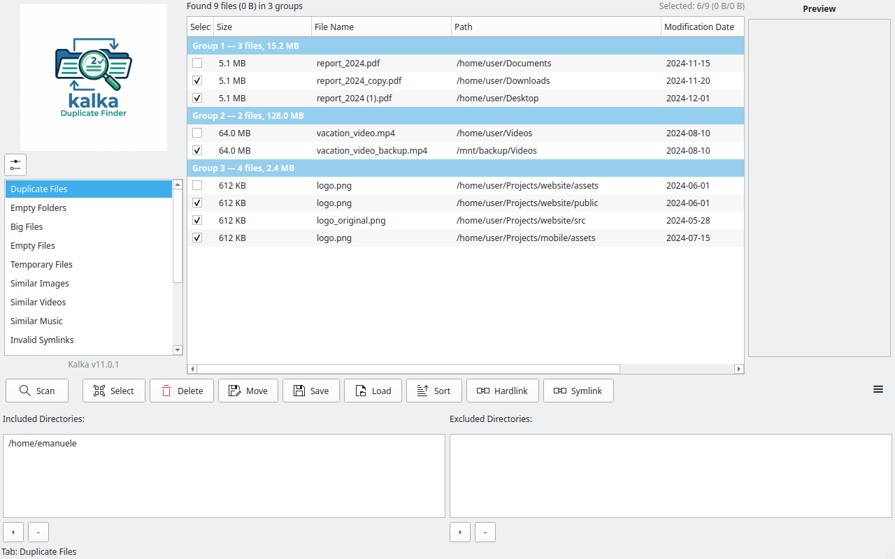
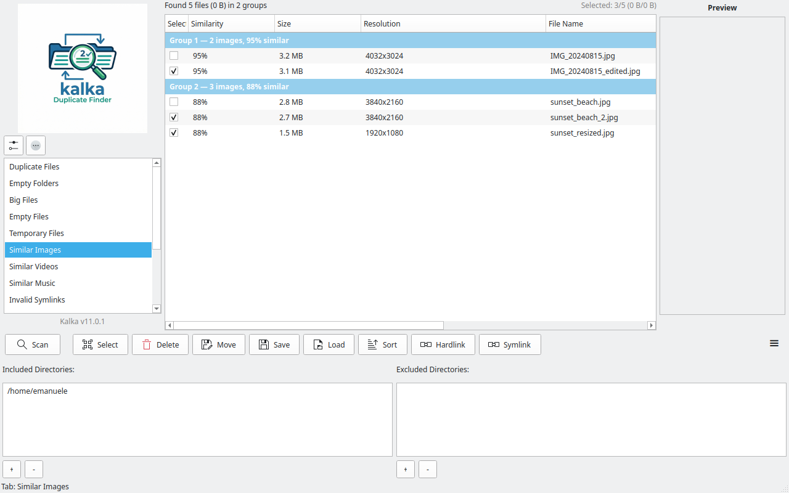
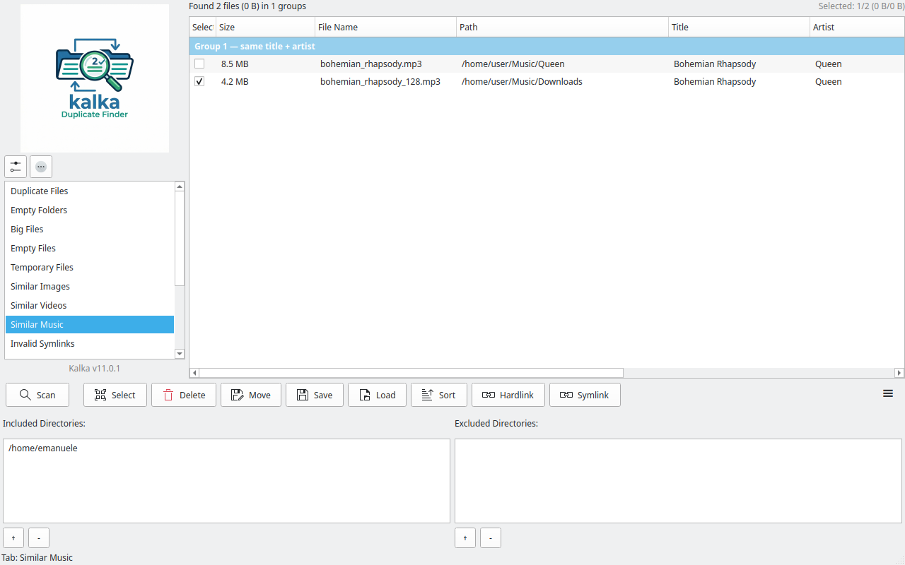
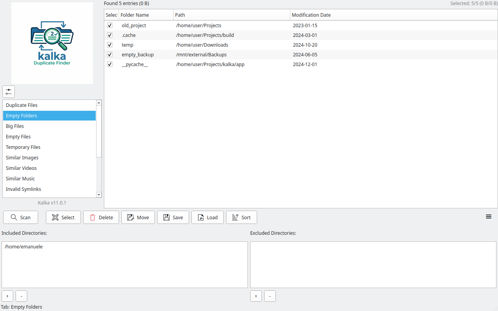
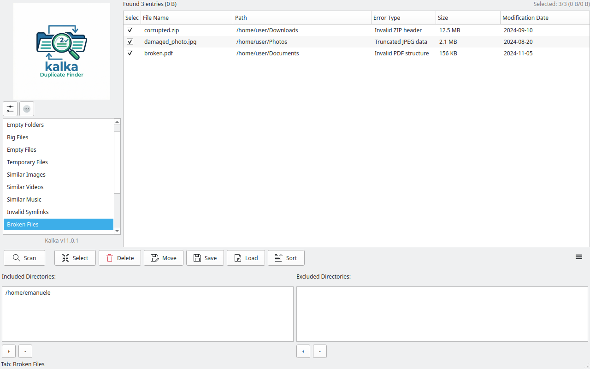

# Kalka

<div align="center">


**A modern Qt 6 / PySide6 desktop frontend for [Czkawka](https://github.com/qarmin/czkawka)**

[](../LICENSE)
[](https://www.python.org/)
[](https://pypi.org/project/PySide6/)
</div>

---

Kalka uses `czkawka_cli` as its backend, communicating via JSON output for results and `--json-progress` for real-time progress data. It follows the [KDE Plasma Human Interface Guidelines](https://develop.kde.org/hig/) for spacing, icons, and theme integration.

## Screenshots

<div align="center">

| Duplicate files | Similar images |
|:-:|:-:|
|  |  |

| Similar music | Empty folders |
|:-:|:-:|
|  |  |

| Broken files | Settings |
|:-:|:-:|
|  |  |

</div>

> Screenshots generated with `python take_screenshots.py` (uses `QWidget.grab()` with sample data).

## Features

### 14 Scanning Tools

| Tool | Description |
|------|-------------|
| Duplicate Files | By hash (BLAKE3/CRC32/XXH3), size, name, fuzzy name, or size+name |
| Empty Folders / Files | Find and remove empty entries |
| Big Files | Find biggest or smallest files |
| Temporary Files | Detect common temporary file patterns |
| Similar Images | Configurable hash algorithm, size, and similarity threshold |
| Similar Videos | With crop detection, skip forward, and duration parameters |
| Similar Music | By tags (with fuzzy Jaro-Winkler matching) or audio fingerprint |
| Similar Documents | MinHash shingling for near-duplicate text detection |
| Invalid Symlinks | Detect broken symbolic links |
| Broken Files | Validate audio, PDF, archive, image, and video files |
| Bad Extensions | Find files whose content doesn't match their extension |
| Bad Names | Detect uppercase extensions, emoji, spaces, non-ASCII characters |
| EXIF Remover | Strip metadata from images |
| Video Optimizer | Crop black bars or transcode to efficient formats |

### GUI Features

- **KDE Plasma HIG compliant** — Kirigami spacing, FreeDesktop theme icons with SVG fallback, live dark/light theme switching
- **Two-bar progress display** — current stage + overall progress with percentage, entry/byte counts, and elapsed time
- **Side-by-side file comparison** — split preview for images, text diff, PDF, and video thumbnails
- **Async preview loading** — images, videos, and PDFs load in background threads
- **Scan profiles** — save and load named scan configurations
- **CSV/JSON/text export** — export results in standard formats
- **Hamburger menu** — profiles, settings, and about with credits/license tabs
- **Grouped results view** — tree display with sortable columns and context menus
- **Smart selection** — combine criteria with AND/OR logic (biggest + newest, etc.)
- **File actions** — delete (trash/permanent), move/copy, hardlink, symlink, rename
- **Per-tool settings** — all tool-specific options in collapsible panels
- **Drag & drop** — drop folders onto the directory panel
- **Idle-priority scanning** — nice/ionice support for background scans
- **No-self-compare mode** — compare across directories without intra-directory matches
- **Internationalization** — Fluent i18n with 26+ language translations
- **Accessibility** — keyboard navigation, screen reader labels, DPI-aware sizing

## Requirements

- Python 3.10+
- PySide6 >= 6.6.0
- `czkawka_cli` binary (installed or in PATH)
- Optional: `send2trash` (for trash support on Linux)
- Optional: `Pillow` (for EXIF cleaning fallback)
- Optional: `fluent.runtime` (for i18n support)

## Quick Start

```shell
# 1. Build the CLI backend
cargo build --release -p czkawka_cli

# 2. Install Python dependencies
cd kalka
pip install -r requirements.txt

# 3. Run
python main.py
```

The application auto-detects the `czkawka_cli` binary from PATH or the cargo target directory. Configure the path manually in Settings if needed.

## Architecture

```
kalka/
├── main.py                    # Entry point (i18n init, QApplication)
├── requirements.txt           # Python dependencies
├── i18n/                      # Fluent translation files (26+ languages)
├── icons/                     # App logo and SVG icons
├── app/
│   ├── main_window.py         # Main window orchestration
│   ├── backend.py             # CLI subprocess + async file operations
│   ├── state.py               # Central AppState with signals + profiles
│   ├── models.py              # Enums, dataclasses, column definitions
│   ├── utils.py               # KDE HIG constants, DPI helpers, format_size
│   ├── left_panel.py          # Tool selection sidebar
│   ├── results_view.py        # Tree widget with batch insertion
│   ├── action_buttons.py      # Toolbar with FreeDesktop theme icons
│   ├── tool_settings.py       # Per-tool settings panels
│   ├── settings_panel.py      # Global settings (tabbed)
│   ├── progress_widget.py     # Two-bar progress with background file counter
│   ├── preview_panel.py       # Async image/video/PDF/text preview
│   ├── bottom_panel.py        # Directory management + drag & drop
│   ├── icons.py               # SVG icon resources with theme fallback
│   ├── localizer.py           # Fluent i18n integration
│   └── dialogs/               # Delete, Move, Select, Sort, Save, Rename, About
```

### How It Works

1. **Scanning** — spawns `czkawka_cli` with `--compact-file-to-save` for JSON results and `--json-progress` on stderr for real-time progress
2. **Progress** — JSON lines on stderr are parsed into `ScanProgress` and displayed as two progress bars (current stage + overall)
3. **Results** — JSON results are parsed into `ResultEntry` objects and displayed in a tree view with group headers
4. **File operations** — delete, move, hardlink, symlink run directly in Python; EXIF cleaning and extension/name fixing use async CLI subcommands
5. **Theme** — inherits system palette (Breeze, Adwaita, etc.) with no hardcoded colors; `paletteChanged` signal enables live theme switching

## License

MIT
